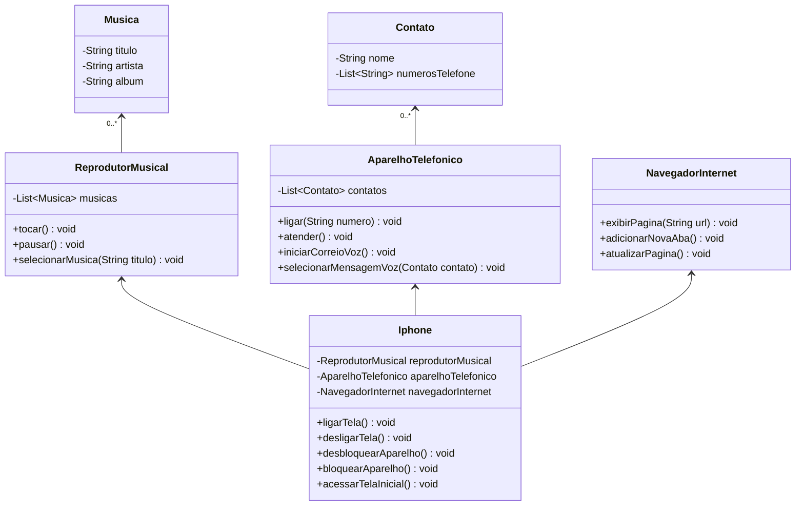

# Modelagem e Diagramação de um Componente iPhone

Os requisitos desse desafio podem ser encontrados [aqui](https://github.com/digitalinnovationone/trilha-java-basico/tree/main/desafios/poo).

Desafio proposto como requisito de conclusão do bootcamp _Santander 2024 - Backend com Java_, promovido pela [Digital Innovation One](www.dio.me).

## Diagrama

Segue abaixo o diagrama proposto pelo desafio

